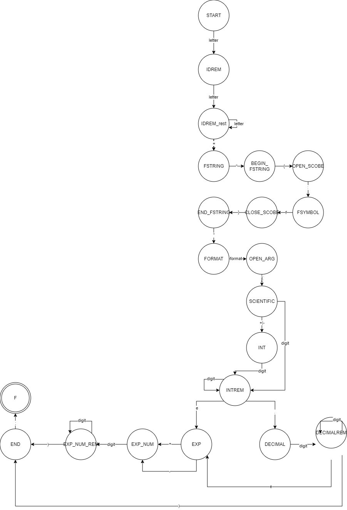

markdown
# Лабораторная работа: Разработка лексического и синтаксического анализатора для форматированных строк Python

## Название и цель лабораторной работы

**Название:** Разработка лексического и синтаксического анализатора для конструкции вида `идентификатор = "{:f}".format(число);`

**Цель работы:** 
- Изучение принципов построения лексических и синтаксических анализаторов
- Разработка конечного автомата для распознавания лексем
- Построение грамматики для заданной синтаксической конструкции
- Реализация метода синтаксического анализа с нейтрализацией ошибок
- Создание программного средства для анализа кода с визуальным интерфейсом

## Сведения об авторе

**Студент:** [Соболев Илья Олегович]  
**Группа:** [АВТ-313]  
**Вариант:** [50]  
**Дата выполнения:** Апрель 2026 г.

## Постановка задачи

Разработать лексический и синтаксический анализатор для конструкции языка Python, представляющей собой присваивание форматированной строки с последующим вызовом метода `format()`:
идентификатор = "{:f}".format(число);


Анализатор должен:
1. Выделять лексемы из входной строки
2. Классифицировать лексемы по типам
3. Проверять синтаксическую корректность конструкции
4. Обнаруживать и сообщать об ошибках
5. Указывать позиции ошибок во входной строке
6. Обеспечивать навигацию по ошибкам

## Вариант задания

**Номер варианта:** [50]

**Описание:** Распознавание конструкции форматированного вывода в Python с использованием спецификатора `{:f}` и метода `format()`.

**Примеры корректных входных строк:**

1. `float_format = "{:f}".format(3.234e+4);`
2. `result = "{:f}".format(-123e-456);`
3. `temp = "{:f}".format(0.001e-5);`

**Допустимые лексемы:**

**Таблица терминальных символов**
markdown
| Терминал | Лексема (тип) | Пример | Описание |
|:--------:|:-------------:|--------|----------|
| `id` | Identificator (1) | `float_format`, `x` | Имя переменной (идентификатор) |
| `=` | AssignmentOperator (4) | `=` | Оператор присваивания |
| `"` | Quote (5) | `"` | Двойная кавычка |
| `{` | OpenBrace (21) | `{` | Открывающая фигурная скобка |
| `:` | Colon (22) | `:` | Двоеточие |
| `f` | LetterF (23) | `f` | Буква f (спецификатор формата) |
| `}` | CloseBrace (24) | `}` | Закрывающая фигурная скобка |
| `.` | Dot (9) | `.` | Точка (оператор доступа) |
| `format` | KeyWord (2) | `format` | Ключевое слово format |
| `(` | OpenScobe (16) | `(` | Открывающая круглая скобка |
| `)` | CloseScobe (17) | `)` | Закрывающая круглая скобка |
| `num` | Int/Double/... (12–15) | `123`, `3.14`, `-5e-2` | Число (целое, вещественное, с экспонентой) |
| `+` | Plus (8) | `+` | Знак плюс (в экспоненте) |
| `-` | Minus (7) | `-` | Знак минус (в экспоненте) |
| `;` | Ending (18) | `;` | Точка с запятой |

**Таблица нетерминальных символов**
markdown
| Нетерминал | Описание | Раскрывается во что |
|:----------:|----------|---------------------|
| `<START>` | Начальный символ грамматики | вся конструкция целиком |
| `<IDREM>` | Продолжение идентификатора (tail) | остаток имени переменной |
| `<FSTRING>` | Форматная строка | `"{:f}"` |
| `<BEGIN_FSTRING>` | Начало форматной строки | после открывающей кавычки |
| `<OPEN_SCOBE>` | Открывающая фигурная скобка | `{` |
| `<COLON>` | Двоеточие внутри скобок | `:` |
| `<FSYMBOL>` | Спецификатор формата | `f` |
| `<CLOSE_SCOBE>` | Закрывающая фигурная скобка | `}` |
| `<END_FSTRING>` | Конец форматной строки | после закрывающей кавычки |
| `<FORMAT>` | Метод format | `format` |
| `<OPEN_ARG>` | Открывающая скобка аргумента | `(` |
| `<SCIENTIFIC>` | Число в научной нотации | целая и дробная часть, экспонента |
| `<INT>` | Целая часть числа | последовательность цифр |
| `<INTREM>` | Продолжение целой части | цифры, точка, либо `e` |
| `<DECIMAL>` | Дробная часть | после десятичной точки |
| `<DECIMALREM>` | Продолжение дробной части | цифры либо `e` |
| `<EXP>` | Экспонента | `e` со знаком |
| `<EXP_NUM>` | Число экспоненты | цифры экспоненты |
| `<EXP_NUM_REM>` | Продолжение экспоненты | цифры либо `)` |
| `<END>` | Конец оператора | `;` |

## Разработка грамматики

## Грамматика

```
1.<START> -> letter <IDREM>
2.<IDREM> -> letter <IDREM>
3.<IDREM> -> '=' <FSTRING>
4.<FSTRING> -> '"' <BEGIN_FSTRING>
5.<BEGIN_FSTRING> -> '{' <OPEN_SCOBE>
6.<OPEN_SCOBE> -> ':' <COLON>
7.<COLON> -> 'f' <FSYMBOL>
8.<FSYMBOL> -> '}' <CLOSE_SCOBE>
9.<CLOSE_SCOBE> -> '"' <END_FSTRING>
10.<END_FSTRING> -> '.' <FORMAT>
11.<FORMAT> -> 'format'<OPEN_ARG>
12.<OPEN_ARG> -> '(' <SCIENTIFIC>
13.<SCIENTIFIC> -> '+'<INT>
14.<SCIENTIFIC> -> '-'<INT>
15.<SCIENTIFIC> -> digit <INTREM>
16.<INT> -> digit <INTREM>
17.<INTREM> -> digit<INTREM>
18.<INTREM> -> 'e' <EXP>
19.<INTREM> -> '.'<DECIMAL>
20.<DECIMAL> -> digit <DECIMALREM>
21.<DECIMALREM> -> digit <DECIMALREM>
22.<DECIMALREM> -> 'e' <EXP>
23.<EXP> -> '+'<EXP_NUM>
24.<EXP> -> '-'<EXP_NUM>
25.<EXP_NUM> -> digit <EXP_NUM_REM>
26.<EXP_NUM_REM> -> digit <EXP_NUM_REM>
27.<EXP_NUM_REM> -> ')'<END>
28.<END> -> ';'

letters ->'a'|'b'|'c'|...|'z'|'A'|'B'|'C'|...|'Z'|'_'
digit -> '1'|'2'|'3'|'4'|'5'|'6'|'7'|'8'|'9'|'0'

```

## Классификация грамматики (по Хомскому)

Разработанная грамматика G[<F>] относится к автоматному типу (тип 3 по классификации Хомского) . В учебном пособии Шорникова Ю.В. «Теория языков программирования: проектирование и реализация» данный тип грамматик рассматривается как основа для построения конечно-автоматных распознавателей .

Согласно классификации, представленной в пособии, все правила автоматной грамматики имеют вид:

A → aB (праволинейное правило) — нетерминал A порождает терминал a с последующим нетерминалом B

A → a (терминальное правило) — нетерминал A порождает терминал a

A → ε (при необходимости) — порождение пустой цепочки

### Схема конечного автомата



*Рисунок 1 - Схема конечного автомата*

## Диагностика и нейтрализация синтаксических ошибок

### Метод Айронса

Для нейтрализации синтаксических ошибок используется **метод Айронса (panic mode recovery)**.

### Принцип работы метода:

1. **Обнаружение ошибки**: при несоответствии текущей лексемы ожидаемой в данном состоянии
2. **Анализ ошибки**: определение типа ошибки и возможности ее исправления
3. **Нейтрализация**: применение одной из стратегий восстановления

### Стратегии нейтрализации:

| Код | Стратегия | Описание |
|-----|-----------|----------|
| 1 | Пропуск лексемы | Удаление недопустимого символа из потока |
| 2 | Вставка лексемы | Добавление ожидаемого символа в поток |
| 3 | Замена лексемы | Замена ошибочного символа на ожидаемый |
| 4 | Синхронизация | Переход в состояние, где анализ может продолжиться |

### Алгоритм обработки ошибки:
function HandleError(state, lexem):
errorCode = DetermineErrorCode(state, lexem)

switch errorCode:
case SKIP:
пропустить лексему
case INSERT:
вставить ожидаемую лексему
case REPLACE:
заменить лексему
case SYNC:
найти синхронизирующее состояние
перейти в него

## Тестовые примеры

### Пример 1: Корректная строка

**Входная строка:** `float_format = "{:f}".format(3.234e+4);`

**Результат анализа:**


*Рисунок 2 - Результат анализа корректной строки*

### Пример 2: Строка с недопустимым символом

**Входная строка:** `float_form*at = "{:f}".format(3.234e+4);`

**Результат анализа:**


*Рисунок 3 - Результат анализа строки с недопустимым символом*

### Пример 3: Многострочный пример

**Входная строка:**
float_format = "{:f}".format(3.234e+4);
result = "{:f}".format(-1.23e-56);
temp = "{:f}".format(0.001e+3);


**Результат анализа:**


*Рисунок 4 - Результат анализа многострочного примера*

### Пример 4: Строка с ошибкой в форматном спецификаторе

**Входная строка:** `error = "{:g}".format(123e+1);`

**Результат анализа:**


*Рисунок 5 - Результат анализа строки с ошибкой в форматном спецификаторе*

### Таблица тестовых примеров

| № | Входная строка | Результат | Описание ошибки |
|---|----------------|-----------|-----------------|
| 1 | `float_format = "{:f}".format(3.234e+4);` | Успех | - |
| 2 | `result = "{:f}".format(-123.456);` | Успех | - |
| 3 | `temp = "{:f}".format(0.001);` | Успех | - |
| 4 | `result = "{:f}".format(@123.456);` | Ошибка | Недопустимый символ '@' |
| 5 | `error = "{:g}".format(123);` | Ошибка | Ожидалась буква 'f' в спецификаторе |
| 6 | `x = "{:f}".format` | Ошибка | Отсутствует аргумент и ';' |
| 7 | `y = "{:f}"format(5);` | Ошибка | Отсутствует точка перед format |
| 8 | `z = "{:f}".format(5)` | Ошибка | Отсутствует ';' в конце |

## Выводы

В ходе выполнения лабораторной работы были выполнены следующие задачи:

1. **Разработана грамматика** для конструкции форматированного вывода в Python, которая относится к классу контекстно-свободных грамматик.

2. **Построен конечный автомат** для распознавания лексем, реализующий детерминированный анализ.

3. **Реализован синтаксический анализатор** с использованием метода конечного автомата, обеспечивающий:
   - Последовательную проверку структуры входной строки
   - Обнаружение синтаксических ошибок
   - Указание точного местоположения ошибки

4. **Внедрен метод Айронса** для нейтрализации синтаксических ошибок, включающий:
   - Пропуск недопустимых символов
   - Вставку пропущенных элементов
   - Замену ошибочных конструкций
   - Синхронизацию состояний

5. **Разработан графический интерфейс** с функциями:
   - Редактирования исходного кода
   - Отображения результатов анализа в табличной форме
   - Подсветки ошибок
   - Навигации по ошибкам

Разработанный анализатор успешно обрабатывает корректные строки, обнаруживает различные типы ошибок и предоставляет информативные сообщения для их исправления.