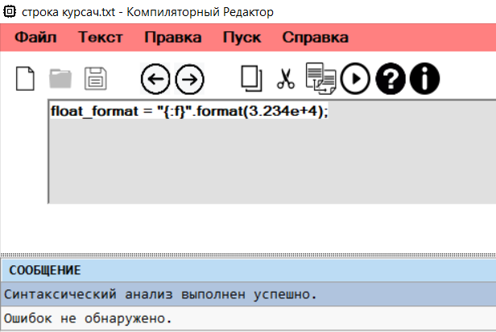
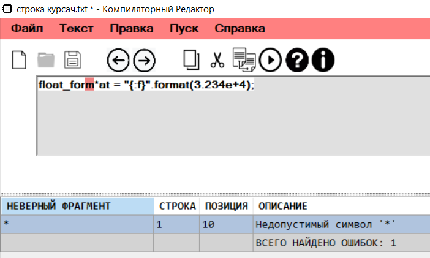
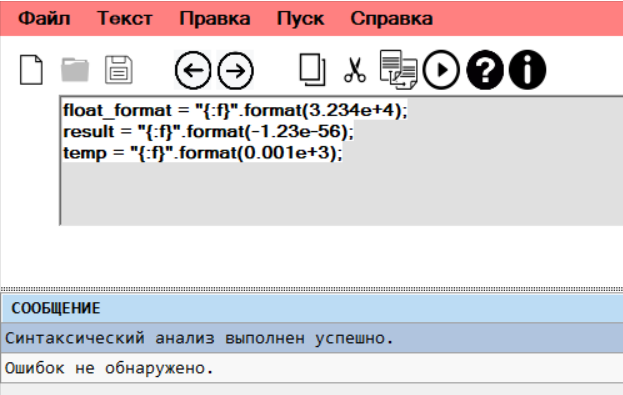
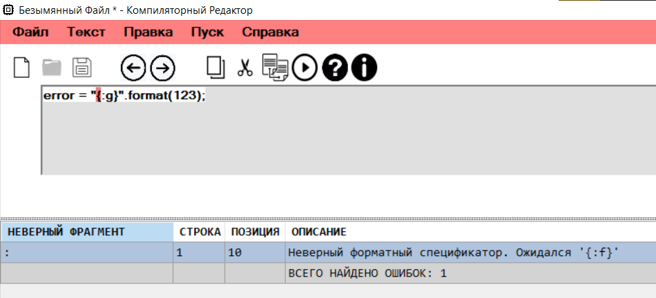

markdown
# Лабораторная работа: Разработка лексического и синтаксического анализатора для форматированных строк Python

## Название и цель лабораторной работы

**Название:** Разработка лексического и синтаксического анализатора для конструкции вида `идентификатор = "{:f}".format(число);`

**Цель работы:** 
- Изучение принципов построения лексических и синтаксических анализаторов
- Разработка конечного автомата для распознавания лексем
- Построение грамматики для заданной синтаксической конструкции
- Реализация метода синтаксического анализа с нейтрализацией ошибок
- Создание программного средства для анализа кода с визуальным интерфейсом

## Сведения об авторе

**Студент:** [Соболев Илья Олегович]  
**Группа:** [АВТ-313]  
**Вариант:** [50]  
**Дата выполнения:** Апрель 2026 г.

## Постановка задачи

Разработать лексический и синтаксический анализатор для конструкции языка Python, представляющей собой присваивание форматированной строки с последующим вызовом метода `format()`:
идентификатор = "{:f}".format(число);


Анализатор должен:
1. Выделять лексемы из входной строки
2. Классифицировать лексемы по типам
3. Проверять синтаксическую корректность конструкции
4. Обнаруживать и сообщать об ошибках
5. Указывать позиции ошибок во входной строке
6. Обеспечивать навигацию по ошибкам

## Вариант задания

**Номер варианта:** [50]

**Описание:** Распознавание конструкции форматированного вывода в Python с использованием спецификатора `{:f}` и метода `format()`.

**Примеры корректных входных строк:**

1. `float_format = "{:f}".format(3.234e+4);`
2. `result = "{:f}".format(-123.456);`
3. `temp = "{:f}".format(0.001e-5);`

**Допустимые лексемы:**

| Код | Тип лексемы | Описание | Пример |
|-----|-------------|----------|--------|
| 1 | Identificator | Идентификатор | `float_format`, `result` |
| 2 | KeyWord | Ключевое слово | `format` |
| 3 | CharInString | Символ в строке | любой символ в кавычках |
| 4 | AssignmentOperator | Оператор присваивания | `=` |
| 5 | Quote | Кавычка | `"` |
| 7 | Minus | Минус | `-` |
| 8 | Plus | Плюс | `+` |
| 9 | Dot | Точка | `.` |
| 12 | Int | Целое число | `123`, `456` |
| 13 | Double | Вещественное число | `3.14`, `0.001` |
| 14 | MinusComplexDouble | Отрицательное вещественное | `-123.456` |
| 15 | PlusComplexDouble | Положительное вещественное | `3.234e+4` |
| 16 | OpenScobe | Открывающая скобка | `(` |
| 17 | CloseScobe | Закрывающая скобка | `)` |
| 18 | Ending | Точка с запятой | `;` |
| 19 | Error | Ошибка | нераспознанный символ |
| 21 | OpenBrace | Открывающая фигурная скобка | `{` |
| 22 | Colon | Двоеточие | `:` |
| 23 | LetterF | Буква f | `f` |
| 24 | CloseBrace | Закрывающая фигурная скобка | `}` |
| 25 | StringChar | Символ строки | символ в кавычках |

## Разработка грамматики

### Формальное определение грамматики G = (VN, VT, P, S)

## Грамматика

```1.<START> -> IdentifyLetters <IDREM>
2.<IDREM> -> Symbols <IDREM>
3.<IDREM> -> '=' <FSTRING>
4.<FSTRING> -> '"' <BEGIN_FSTRING>
5.<BEGIN_FSTRING> -> '{' <OPEN_SCOBE>
6.<OPEN_SCOBE> -> ':' <COLON>
7.<COLON> -> 'f' <FSYMBOL>
8.<FSYMBOL> -> '}' <CLOSE_SCOBE>
9.<CLOSE_SCOBE> -> '"' <END_FSTRING>
10.<END_FSTRING> -> '.' <FORMAT>
11.<FORMAT> -> 'format'<OPEN_ARG>
12.<OPEN_ARG> -> '(' <SCIENTIFIC>
13.<SCIENTIFIC> -> '+'<INT>
14.<SCIENTIFIC> -> '-'<INT>
15.<SCIENTIFIC> -> digit <INTREM>
16.<INT> -> digit <INTREM>
17.<INTREM> -> digit<INTREM>
18.<INTREM> -> 'e' <EXP>
19.<INTREM> -> '.'<DECIMAL>
20.<DECIMAL> -> digit <DECIMALREM>
21.<DECIMALREM> -> digit <DECIMALREM>
22.<DECIMALREM> -> 'e' <EXP>
23.<EXP> -> '+'<EXP_NUM>
24.<EXP> -> '-'<EXP_NUM>
25.<EXP_NUM> -> digit <EXP_NUM_REM>
26.<EXP_NUM_REM> -> digit <EXP_NUM_REM>
27.<EXP_NUM_REM> -> ')'<END>
28.<END> -> ';'

IdentifyLetters ->'a'|'b'|'c'|...|'z'|'A'|'B'|'C'|...|'Z'|'_'
Symbols -> 'a'|'b'|'c'|...|'z'|'A'|'B'|'C'|...|'Z'|'1'|'2'|'3'|'4'|'5'|'6'|'7'|'8'|'9'|'0'|'_'
digit -> '1'|'2'|'3'|'4'|'5'|'6'|'7'|'8'|'9'|'0'

Z = <START>
VT = {a,b,c,...,z,A,B,C,...,Z,_,=,+,-,;,0,1,2,...,9};
VN = {<START>,<IDREM>,<FSTRING>,<BEGIN_FSTRING>,<OPEN_SCOBE>,<COLON>,<FSYMBOL>,<CLOSE_SCOBE>,<END_FSTRING>,<FORMAT>,<OPEN_ARG>,<SCIENTIFIC>,<INT>,<INTREM>,<DECIMAL>,<DECIMALREM>,<EXP>,<EXP_NUM>,<EXP_NUM_REM>};
```
### Схема рекурсивного спуска


## Классификация грамматики (по Хомскому)

Разработанная грамматика относится к **контекстно-свободной грамматике (КС-грамматике, тип 2)** по классификации Хомского.

**Обоснование:**
1. Левая часть каждого правила содержит ровно один нетерминальный символ
2. Правила имеют вид `A → α`, где A ∈ VN, α ∈ (VN ∪ VT)*
3. Применение правил не зависит от контекста
4. Грамматика позволяет описывать вложенные конструкции

**Характеристики:**
- **Не леворекурсивная** (левая рекурсия отсутствует)
- **Детерминированная** (однозначность достигается за счет детерминированного автомата)
- **LL(1)-грамматика** (можно построить LL(1)-анализатор)

## Метод анализа

### Схема конечного автомата
[Start] --(id)--> [IdRem] --(=)--> [AfterEqual] --(")--> [OpenQuote] --({)--> [OpenBrace]
--(:)--> [Colon] --(f)--> [LetterF] --(})--> [CloseBrace] --(")--> [CloseQuote] --(.)--> [AfterDot]
--(format)--> [Format] --(()--> [OpenArg] --(число)--> [AfterNumber] --())--> [CloseArg] --(;)--> [End]


### Алгоритм синтаксического анализа

Для реализации синтаксического анализа используется **метод конечного автомата**:

1. **Инициализация**: начальное состояние `Start`, позиция = 0
2. **Чтение лексемы**: извлечение текущей лексемы из списка
3. **Переход**: на основе текущего состояния и типа лексемы выполняется переход в новое состояние
4. **Проверка корректности**: если переход невозможен, фиксируется ошибка
5. **Продолжение**: переход к следующей лексеме

### Диаграмма состояний


*Рисунок 1 - Диаграмма состояний конечного автомата*

## Диагностика и нейтрализация синтаксических ошибок

### Метод Айронса

Для нейтрализации синтаксических ошибок используется **метод Айронса (panic mode recovery)**.

### Принцип работы метода:

1. **Обнаружение ошибки**: при несоответствии текущей лексемы ожидаемой в данном состоянии
2. **Анализ ошибки**: определение типа ошибки и возможности ее исправления
3. **Нейтрализация**: применение одной из стратегий восстановления

### Стратегии нейтрализации:

| Код | Стратегия | Описание |
|-----|-----------|----------|
| 1 | Пропуск лексемы | Удаление недопустимого символа из потока |
| 2 | Вставка лексемы | Добавление ожидаемого символа в поток |
| 3 | Замена лексемы | Замена ошибочного символа на ожидаемый |
| 4 | Синхронизация | Переход в состояние, где анализ может продолжиться |

### Алгоритм обработки ошибки:
function HandleError(state, lexem):
errorCode = DetermineErrorCode(state, lexem)

switch errorCode:
case SKIP:
пропустить лексему
case INSERT:
вставить ожидаемую лексему
case REPLACE:
заменить лексему
case SYNC:
найти синхронизирующее состояние
перейти в него

## Тестовые примеры

### Пример 1: Корректная строка

**Входная строка:** `float_format = "{:f}".format(3.234e+4);`

**Результат анализа:**



*Рисунок 2 - Результат анализа корректной строки*

### Пример 2: Строка с недопустимым символом

**Входная строка:** `float_form*at = "{:f}".format(3.234e+4);`

**Результат анализа:**



*Рисунок 3 - Результат анализа строки с недопустимым символом*

### Пример 3: Многострочный пример

**Входная строка:**
float_format = "{:f}".format(3.234e+4);
result = "{:f}".format(-123.456);
temp = "{:f}".format(0.001);


**Результат анализа:**



*Рисунок 4 - Результат анализа многострочного примера*

### Пример 4: Строка с ошибкой в форматном спецификаторе

**Входная строка:** `error = "{:g}".format(123);`

**Результат анализа:**



*Рисунок 5 - Результат анализа строки с ошибкой в форматном спецификаторе*

### Таблица тестовых примеров

| № | Входная строка | Результат | Описание ошибки |
|---|----------------|-----------|-----------------|
| 1 | `float_format = "{:f}".format(3.234e+4);` | Успех | - |
| 2 | `result = "{:f}".format(-123.456);` | Успех | - |
| 3 | `temp = "{:f}".format(0.001);` | Успех | - |
| 4 | `result = "{:f}".format(@123.456);` | Ошибка | Недопустимый символ '@' |
| 5 | `error = "{:g}".format(123);` | Ошибка | Ожидалась буква 'f' в спецификаторе |
| 6 | `x = "{:f}".format` | Ошибка | Отсутствует аргумент и ';' |
| 7 | `y = "{:f}"format(5);` | Ошибка | Отсутствует точка перед format |
| 8 | `z = "{:f}".format(5)` | Ошибка | Отсутствует ';' в конце |

## Выводы

В ходе выполнения лабораторной работы были выполнены следующие задачи:

1. **Разработана грамматика** для конструкции форматированного вывода в Python, которая относится к классу контекстно-свободных грамматик.

2. **Построен конечный автомат** для распознавания лексем, реализующий детерминированный анализ.

3. **Реализован синтаксический анализатор** с использованием метода конечного автомата, обеспечивающий:
   - Последовательную проверку структуры входной строки
   - Обнаружение синтаксических ошибок
   - Указание точного местоположения ошибки

4. **Внедрен метод Айронса** для нейтрализации синтаксических ошибок, включающий:
   - Пропуск недопустимых символов
   - Вставку пропущенных элементов
   - Замену ошибочных конструкций
   - Синхронизацию состояний

5. **Разработан графический интерфейс** с функциями:
   - Редактирования исходного кода
   - Отображения результатов анализа в табличной форме
   - Подсветки ошибок
   - Навигации по ошибкам

Разработанный анализатор успешно обрабатывает корректные строки, обнаруживает различные типы ошибок и предоставляет информативные сообщения для их исправления.